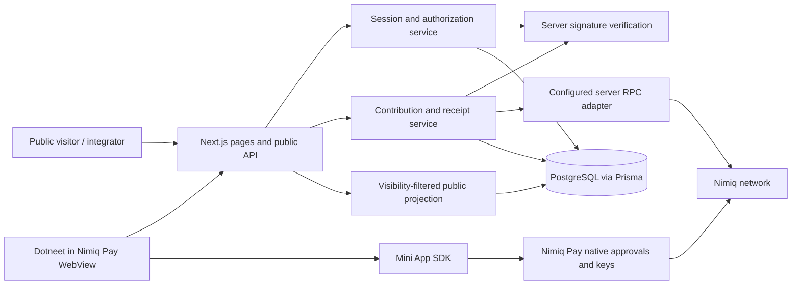
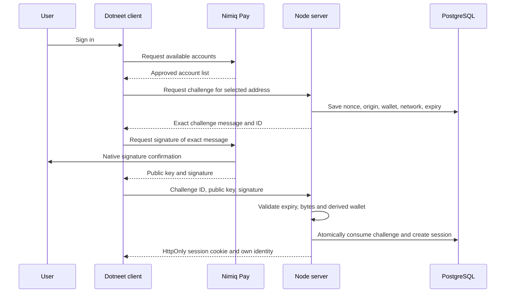
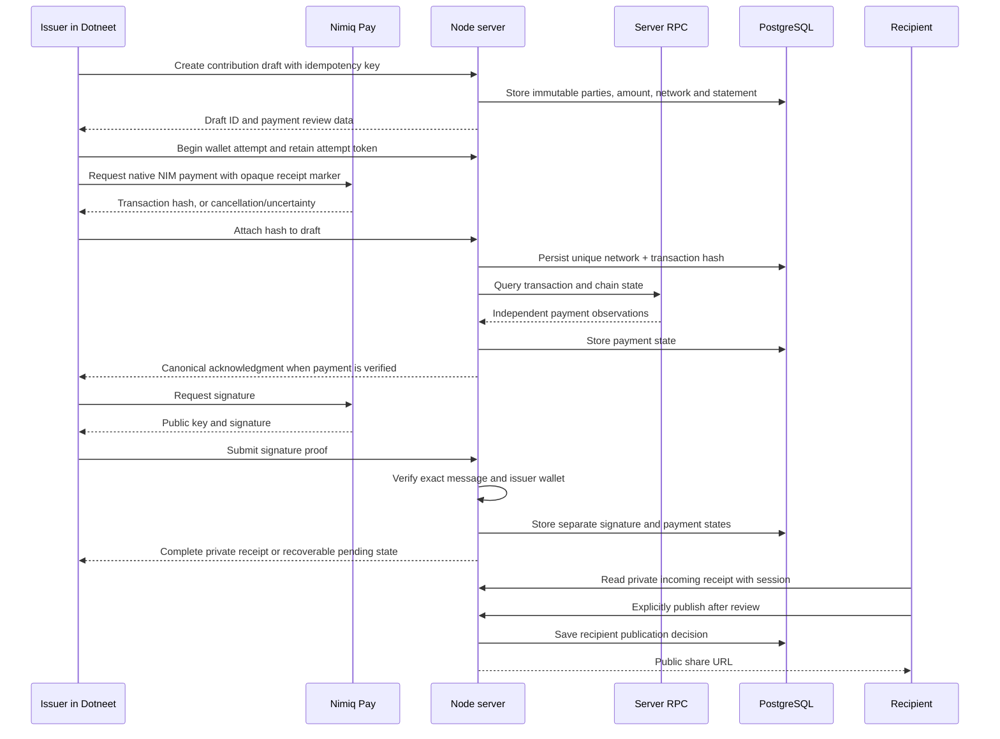
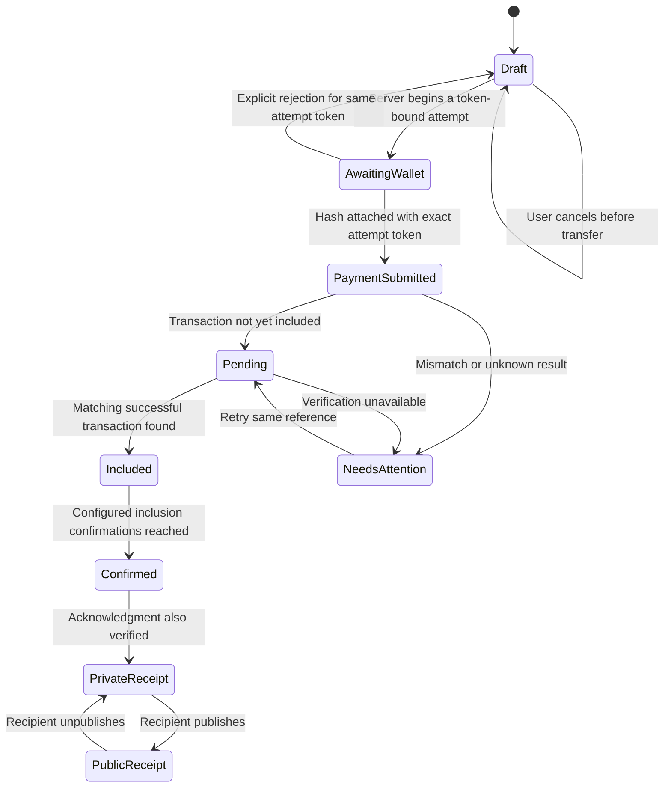

# Dotneet — System Architecture

**Revision:** 1.1 · **Reconciled:** 11 September 2026. Architecture aligned with current backend source and specified final fixes. Native device/RPC/deployment validation is not implied.

## Baseline and architectural decision

The inspected baseline is `Mofe-Bankole/neet`, branch `master`, commit `6677889fcbb782eef22223d8172bbc7584dda3ea`. Its package manifest uses Next.js 16.3.4, React 19.2.8, Prisma 5.22, PostgreSQL, Tailwind 4 and `@nimiq/mini-app-sdk`. It already has App Router pages, route handlers, a Prisma singleton and identity/profile models.

Retain **one Next.js application with Node.js route handlers**, a PostgreSQL database accessed through Prisma, and client-side Nimiq Pay integration. Next.js is both the frontend framework and the backend HTTP entry point. A second Express service would add deployment, session, CORS and operational complexity without an MVP requirement. Use actual PostgreSQL for local development, integration tests and deployment. The supplied Compose service uses PostgreSQL18.4 on loopback54329 with a named volume; native PostgreSQL is also supported. The earlier socket-emulated adapter was removed after concurrent-client correctness failures and is not supported.

Preserve the baseline tables as legacy data, and add separate `WalletProfile`, `AuthChallenge`, `WalletSession`, `ContributionReceipt` and `RateLimitBucket` models. New network+wallet and network+handle uniqueness belongs to `WalletProfile`. Do not automatically transform old `Identity`, `Endorsement` or `ReputationEvent` records into new verified records.

Node runtime is required for server crypto/database dependencies. Do not place database or server verification code in browser bundles or assume Edge compatibility. Read the installed Next.js documentation required by the repository's `AGENTS.md` before changing framework-specific APIs.

## Component boundary

Current route/page components are source-present as follows. This inventory is not a browser/device test result.

| Page | Component / responsibility |
|---|---|
| `/` | Public landing and reusable sample receipt illustration |
| `/app` | WalletDashboard; signed session, name claim, own profile edits and receipt list |
| `/acknowledge` | AcknowledgeForm; recipient/decimal amount/statement/evidence draft |
| `/<handle>` | PublicProfile; API-backed public profile and latest50 public receipts |
| `/receipts/<id>` | ReceiptView; participant/public inspection, wallet attempts, verification, signing, publication, withdrawal, JSON download |
| `/preview` | Preview; isolated fictional client-state walkthrough |
| `/design-system` | Component/foundation reference |
| `/api` | Human-readable public API reference |

Shared foundations live in `src/design/tokens.css`, `src/app/globals.css`, `src/components/system.tsx` and `forms.tsx`; wallet session behavior in `src/hooks/useSession.ts`; browser API types/error handling in `src/lib/client.ts`. Receipt and profile pages read APIs in client components. Clipboard/manual URL sharing is implemented; native Web Share is deferred.

The native wallet authorizes signatures and payments. The web client requests operations and renders progress. The server authenticates wallet control, enforces ownership, checks evidence, stores records and decides what is public. The chain records transfers. Dotneet's names, profile text, publication choices and receipt index remain hosted application data.

The official framework describes provider injection, native approval and keys remaining in the wallet. [Mini App overview](https://nimiq.dev/mini-apps).

## Trust boundaries and authoritative inputs

| Input / state | Trusted authority | What must not be trusted |
|---|---|---|
| Authenticated wallet | Verified server challenge + public-key-derived address + active session | Browser account string or hidden form field |
| Claim/profile owner | Session wallet joined to stored user/identity | Submitted user ID or identity ID alone |
| Signing statement | Versioned canonical server-generated message from frozen fields | A user-supplied replacement message |
| Signature provenance | Cryptographic validation against canonical bytes and expected signer | Existence of a hex string or client success boolean |
| Payment details | Independently obtained configured-network transaction data | SDK hash alone, explorer screenshot or submitted amount |
| Payment finality | Documented adapter policy and actual chain observations | Arbitrary UI timer or generic confirmation label |
| Publication | Authenticated recipient's explicit decision | Issuer request, share-click inference or public-by-default serializer |
| Public count | Count of public qualifying records in the same query projection | Aggregate over private incoming records |

RPC is a deployment dependency and trust assumption. Querying a third-party RPC independently of the browser is useful but is not the same as operating a locally verified node. Describe the deployed configuration honestly.

## Authentication sequence

Use a random 32-byte hex session token and store its SHA-256 hash. The implementation uses `dotneet_session` and browser-bound `dotneet_challenge` cookies with HttpOnly, SameSite Strict, path `/`, and Secure for HTTPS origins. Challenge lifetime is 300 seconds; session lifetime 86,400 seconds. Mutations require an exact Origin match with configured `APP_ORIGIN`; the initial challenge additionally requires its initiating cookie binding when verified. Production configuration requires an HTTPS origin with no path/trailing slash. A network-specific session can exist before a profile is claimed.

Do not retain raw challenge signatures in analytics or application logs. Challenge consumption and session creation must not permit simultaneous valid replays. Expired challenge and session cleanup can initially be an explicit maintenance action; expiration checks themselves must happen on every use.

## Contribution sequence

The selected contract uses separate payment attachment, payment verification and acknowledgment actions. Payment is verified before the acknowledgment is requested. Issuer and recipient can inspect partial records; only issuer can request payment verification/reconciliation. Public receipt publication waits for both required checks. Normal attachment cannot replace a hash. The single recovery exception independently validates a candidate for an unsigned unfinished record before conditionally replacing the old reference. Signed records cannot change hashes.

## State model

Actual persisted state is `paymentState` with `DRAFT`, `AWAITING_WALLET`, `SUBMITTED`, `CONFIRMED`, `CANCELLED`. Acknowledgment completion is `signatureVerifiedAt != null`; visibility is `publishedAt != null`; issuer withdrawal is `withdrawnAt != null`. Receipt completeness combines confirmed payment and verified signature; active acknowledgment additionally excludes withdrawal. Do not invent separate acknowledgment/visibility enum columns.

Pending/indexing delay, inclusion below the minimum, failed execution, mismatch and unavailable RPC are transient verification outcomes, not stored payment enum values. The UI must render their safe messages without automatically resending. HTTP 202 `PAYMENT_PENDING` is not a successful receipt verification, even though `response.ok` is true.

The diagram shows user-visible conceptual states; only the five listed payment states are persisted. An ambiguous wallet result stays AwaitingWallet until reconciled, and verification outcomes do not reset it to unpaid. The chosen workflow verifies payment before requesting acknowledgment. A paid record with missing signature remains recoverable without repayment.

## Canonical acknowledgment and signature compatibility

The signed statement binds schema, purpose, origin, receipt ID, issuer/recipient addresses, network, exact integer amount string, statement, evidence URL, hash and receipt creation timestamp. A wrapper adds a random nonce and five-minute submission expiry. Canonicalization uses stable field order and ASCII-escaped JSON; exact message and signature are stored. ASCII escaping removes disagreement between character and UTF-8 byte counts for the signed representation. POST `{action:"challenge"}` creates/reuses the challenge with conditional updates. GET never generates a new one. Changes to covered fields cannot silently alter a signed record.

`sign` returns public key/signature. This implementation uses `sendBasicTransactionWithData`, which returns a transaction hash, takes Luna amounts and attaches `dotneet:<receiptId>` as the required payment reference. Keep contribution text/evidence off-chain. [Official provider API](https://nimiq.dev/mini-apps/api-reference/nimiq-provider).

**Compatibility gate:** verify the installed Mini App signing implementation and a real Nimiq Pay signed fixture. Do not copy an untested message-prefix example. Official Hub documentation contains examples whose displayed spacing differs from older API documentation; that is not a reason to accept arbitrary message framings. Use one supported, tested scheme and record its version. [Current Hub guide](https://nimiq.dev/hub/guide/transactions), [official older signing reference](https://nimiq.github.io/api-reference/sign-message).

## Payment verification and confirmation

The adapter fails closed on unreadable data. It checks configured RPC network, canonical addresses, exact integer amount, transaction hash, hex receipt marker, basic from/to account types, zero flags, successful execution, positive inclusion height and sufficient confirmations. A unique network+hash constraint applies across records. The receipt stores `paymentBlock`, `confirmationCount`, `verificationPolicy` and `paymentVerifiedAt`; it does not store a macro-block finality proof or every raw RPC field.

`getTransactionByHash` does not discover transactions still in the mempool according to the PoS migration documentation; absence is therefore pending/unknown rather than proof of failure. Current block objects distinguish micro and macro blocks. The application must explain its selected inclusion-confirmation policy rather than imply macro-block finality. [Official RPC migration guide](https://nimiq.dev/migration/migration-json-rpc).

The selected MVP policy is `NIMIQ_MIN_CONFIRMATIONS` with default 10, recorded as `nimiq-pos-inclusion-v1-min-<N>`. Here `CONFIRMED` means the matched transfer met that configured inclusion threshold at the check timestamp. It does **not** mean independently proven deterministic finality. Product labels and API documentation must preserve this limitation. No macro-block finality service is implemented. Validate the chosen RPC transaction format and actual Nimiq Pay behavior before claiming live readiness.

Network configuration defaults to testnet; supported numeric IDs are mainnet 24/testnet 5. The adapter first calls `getNetworkId` and expects MainAlbatross/TestAlbatross, then `getTransactionByHash`. It uses a 12-second timeout and requires explicit `NIMIQ_RPC_URL`; production uses HTTPS, while local nonproduction HTTP is allowed only for localhost/127.0.0.1. There is no silent default RPC or verification bypass.

Server-side observation is read-only: the backend must not hold spending keys or send payments. No background process can authorize a user's transfer. Retry verification with a bounded timeout and backoff; persistent outage leaves records pending with a clear message.

## Privacy, caching and safe sharing

Public reads require `publishedAt`, `paymentState='CONFIRMED'` and `signatureVerifiedAt`. Published withdrawn receipts remain historical records, prominently marked, until recipient unpublishes; active counts exclude withdrawal. Public profiles return at most 50 qualifying records and explicitly displayed counts. Private receipt content and attempt tokens must not leak through alternate public-readable routes or metadata. Do not rely on frontend hiding.

All JSON responses currently use `Cache-Control: no-store`. Public v1 CORS uses `*` for noncredentialed GET/OPTIONS. Session-based writes are same-origin. An inaccessible private receipt returns generic not-found. Public serializers remove idempotency keys and wallet-attempt tokens; participant responses may contain the current attempt token needed for safe recovery.

Publication exposes wallet associations, amount, statement and evidence. Show this before publishing. Unpublish removes new hosted/public access but cannot remove blockchain transfers or previously copied signatures/screenshots. Do not place confidential contribution descriptions on-chain merely to link a payment.

## Operations and failure isolation

- Build and static public preview should not pretend a database exists when it does not. `/preview` uses separate, visibly fictional client state with no wallet or network operations.
- A database outage disables live mutations and returns useful service-unavailable behavior.
- RPC failure must not destroy drafts or erase existing valid signature proofs.
- Persistent RateLimitBucket implements atomic action/address/global limits for challenge, verification, claim, profile edit, draft creation and issuer writes. Final coverage includes public reads600/minute globally, receipt reads600/minute and recipient publication20/minute per wallet. Validate the actual scopes under PostgreSQL; these limits do not constitute a general distributed denial-of-service guarantee.
- Use PostgreSQL uniqueness and transactional updates for race prevention. UI disabled buttons are only a convenience.
- Reconciliation retries query the stored hash, never call wallet send again.
- Logging includes request ID, action, status and timing, avoiding full signed statements, cookies, signatures, secrets and evidence URLs.
- Deployment consists of one Node web service, PostgreSQL and a configured read RPC. A worker, queue, Redis instance, indexer or separate API service is deferred unless actual scale/reliability requires it.

## Architecture decisions

| Decision | Reason | Tradeoff |
|---|---|---|
| Keep Next.js Node route handlers | Reuses current stack and avoids duplicate hosting/auth | Long tasks need bounded requests and explicit retries |
| Preserve Prisma/PostgreSQL | Existing relational model supports ownership and uniqueness | Hosted database is a central availability dependency |
| Signed sessions | Address strings alone are not ownership proof | Additional native approval for initial login |
| Hosted signed receipts | Small build scope; portable verification material | Availability/publication depend on Dotneet hosting |
| Recipient publication | Contributor controls association with public work history | Builder cannot instantly publish on their behalf |
| Independent proof states | Honest partial progress and cancellation recovery | More states must be designed and tested |
| Public read API only | Useful interoperability with small attack surface | Third-party writes and webhooks deferred |
| No score/legacy points | Removes unsupported trust inference and easy point farming | Less gamification; clearer evidence-oriented product |
